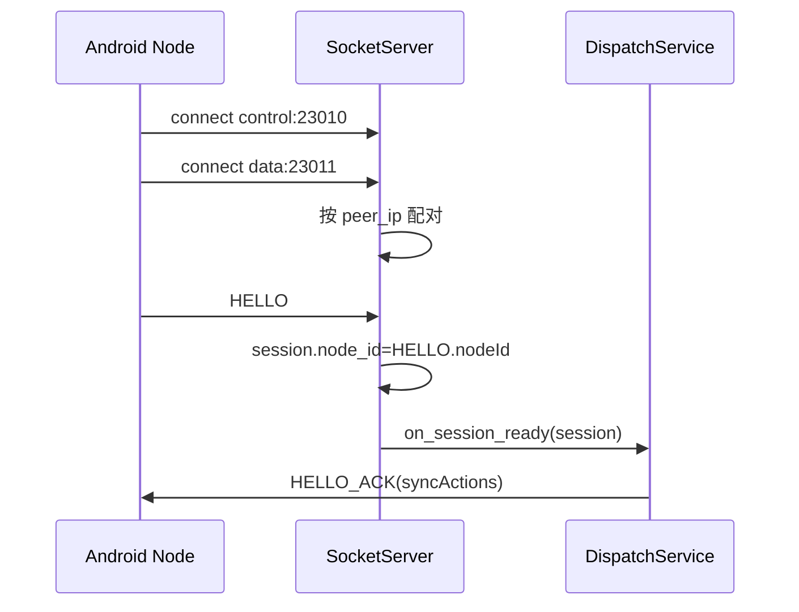
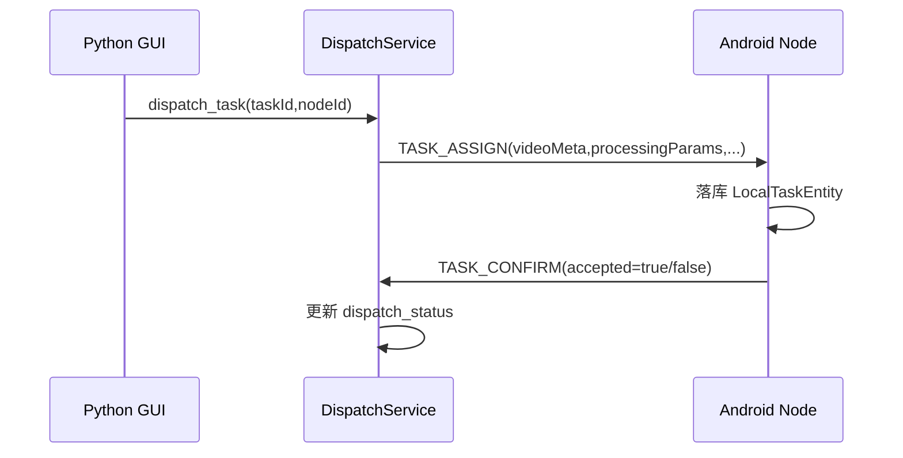
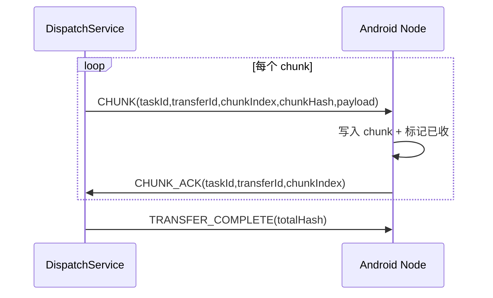
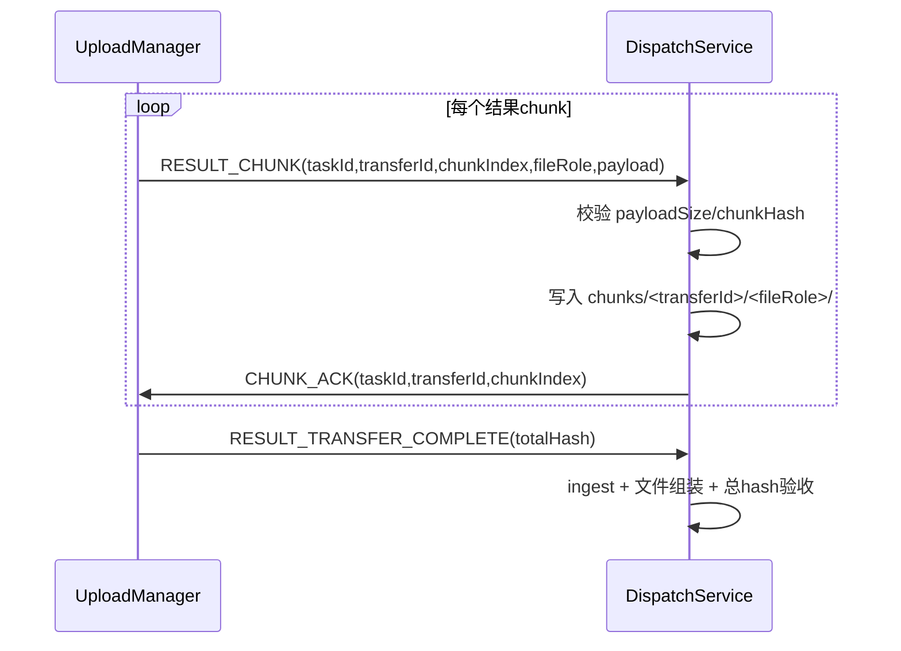

# 协议分场景详解（Server / Android 对照）

> 版本基线：按当前仓库实现整理（Python `src/` + Android `MediaService/`）。  
> 目标：按场景快速定位“谁先发、谁应答、状态怎么变、日志看哪里”。

## 0. 阅读方式

- 先看第 1 节（通道与消息）建立共同语言。
- 再按场景看第 3~8 节（从连接到任务闭环）。
- 联调异常直接看第 9 节（症状 -> 代码入口 -> 关键日志）。

## 1. 双通道与线协议

### 1.1 通道定义

- 控制通道：`23010`
  - 格式：newline-delimited JSON（每条控制消息一行）
  - Python：`src/net/protocol/control_message.py`
  - Android：`MediaService/app/src/main/java/osp/leobert/androd/mediaservice/net/protocol/ControlMessage.kt`
- 数据通道：`23011`
  - 格式：`[4B big-endian headerLen][header JSON][payload]`
  - Python：`src/net/protocol/message_framer.py`
  - Android：`MediaService/app/src/main/java/osp/leobert/androd/mediaservice/net/protocol/MessageFramer.kt`

### 1.2 消息方向总表

| 通道 | 方向 | 消息 |
|---|---|---|
| 控制 | Node -> Server | `HELLO`, `TASK_CONFIRM`, `TASK_STATUS_REPORT` |
| 控制 | Server -> Node | `HELLO_ACK`, `TASK_ASSIGN`, `TASK_STATUS_QUERY` |
| 数据 | Server -> Node | `CHUNK`, `TRANSFER_COMPLETE` |
| 数据 | Node -> Server | `CHUNK_ACK`, `TRANSFER_RESUME_REQUEST`, `RESULT_CHUNK`, `RESULT_TRANSFER_COMPLETE` |
| 数据 | Server -> Node | `CHUNK_ACK`（用于确认 `RESULT_CHUNK`） |

### 1.3 JSON 示例（线协议实际形态）

控制通道（23010）是纯 JSON 行：

```json
{"type":"HELLO","requestId":"8d6c...","nodeId":"android-node","nodeVersion":"1.0.0","capabilities":{"gpu":true,"codec":["hevc","avc"]},"currentTask":null}
```

数据通道（23011）是“帧”，其中 header 是 JSON，payload 是二进制，不在 JSON 里：

```json
{"type":"RESULT_CHUNK","taskId":"12","transferId":"c9ef...","chunkIndex":0,"chunkHash":"ab12...","payloadSize":8388608,"fileRole":"video"}
```

```json
{"type":"CHUNK_ACK","taskId":"12","transferId":"c9ef...","chunkIndex":0,"payloadSize":0}
```

## 2. 角色职责（按实现）

### 2.1 Python Server

- 接入与配对：`src/net/socket/socket_server.py`
- 业务编排：`src/services/dispatch_service.py`
- 结果验收落盘：`src/services/result_ingest_service.py`
- 状态/审计持久化：`src/infra/dispatch_repository.py`

### 2.2 Android Node

- 连接管理：`MediaService/.../SocketConnectionManager.kt`
- 控制通道：`MediaService/.../ControlChannelClient.kt`
- 数据通道：`MediaService/.../DataChannelClient.kt`
- 生命周期编排：`MediaService/.../TaskOrchestrator.kt`
- 结果上传：`MediaService/.../UploadManager.kt`

### 2.3 状态口径对齐（必须一致）

> 这是当前联调最容易错位的部分。`TASK_STATUS_REPORT.status` 必须是“任务状态”，不是“连接状态”。

| 场景 | Android 必须发送 | Python 映射到 dispatch_status |
|---|---|---|
| 刚连上，等待任务 | `AwaitingTask` | `confirmed` |
| 接收下发分片 | `Receiving` | `transferring` |
| 本地处理中 | `Processing` | `running` |
| 上传结果中 | `Uploading` | `uploading` |
| 完成 | `Done` | `done` |
| 失败 | `Error` | `failed` |

约束：

- Android 在收到 `HELLO_ACK` 后，必须退出 `Connecting`（进入 `AwaitingTask` 或恢复态）。
- Android 响应 `TASK_STATUS_QUERY(taskId)` 时，优先返回该 `taskId` 的本地任务快照（Room），不要直接回全局 `TaskState.Connecting`。
- Python 仅将上述任务态映射到 `dispatch_status`；未识别状态会被忽略，不会推进分发状态机。

## 3. 场景 A：节点上线握手（双通道 + HELLO）

### 3.1 目标

- 建立完整 session（控制+数据）
- 节点上线后收到 `HELLO_ACK`

### 3.2 时序



### 3.3 双端动作对照

- Server
  - `SocketServer._handle_control/_handle_data` 完成配对
  - `DispatchService._handle_hello` 发送 `HELLO_ACK`
- Android
  - `SocketConnectionManager.openBothChannels()` 先 control 后 data
  - `ControlChannelClient.connect()` 建连后立即发送 `HELLO`

### 3.5 JSON（握手）

Node -> Server `HELLO`：

```json
{
  "type": "HELLO",
  "requestId": "req-hello-001",
  "nodeId": "android-node",
  "nodeVersion": "1.0.0",
  "capabilities": {"gpu": true, "codec": ["hevc", "avc"]},
  "currentTask": null
}
```

Server -> Node `HELLO_ACK`：

```json
{
  "type": "HELLO_ACK",
  "requestId": "req-helloack-001",
  "serverTime": "2026-03-23T14:00:00+00:00",
  "syncActions": [
    {"action": "QUERY_PROGRESS", "taskId": "12"}
  ]
}
```

### 3.4 关键超时

- 配对等待：30s
- 等待 HELLO：30s

### 3.6 联调判定点（连接成功的最小闭环）

按顺序看到以下日志，才算“连接完成”：

1. Server: `[protocol][hello_received]`
2. Server: `[protocol][hello_ack_sent]`
3. Android: `recv type=HELLO_ACK`
4. Android: 状态迁移到 `AwaitingTask`（或恢复态），而不是长期停在 `Connecting`

若第 3 步存在但第 4 步不存在，优先检查 Android 状态机实现而不是网络连通性。

## 4. 场景 B：任务下发与确认（TASK_ASSIGN / TASK_CONFIRM）

### 4.1 目标

- Server 将 `review_done` 任务分配给指定在线节点
- Node 明确接受或拒绝

### 4.2 时序



### 4.3 双端动作对照

- Server
  - `DispatchService.dispatch_task()`
  - 先注册 `confirm_event` 再发送 `TASK_ASSIGN`（防竞态）
  - 30s 未收到 `TASK_CONFIRM` 则失败
- Android
  - `TaskOrchestrator.handleTaskAssign()`
  - 默认回 `accepted=true`

### 4.4 JSON（任务下发）

Server -> Node `TASK_ASSIGN`（示例裁剪）：

```json
{
  "type": "TASK_ASSIGN",
  "requestId": "req-assign-001",
  "taskId": "12",
  "videoMeta": {
    "videoName": "demo.mp4",
    "fileSizeBytes": 73400320,
    "totalChunks": 9,
    "fileHash": "f5a2..."
  },
  "processingParams": {
    "segments": [
      {"startMs": 1000, "endMs": 4500, "label": "interesting"}
    ],
    "codecHint": "hevc",
    "targetBitrateKbps": 0
  },
  "resultRequirements": {
    "includeResultJson": true,
    "includeLog": true
  }
}
```

Node -> Server `TASK_CONFIRM`：

```json
{
  "type": "TASK_CONFIRM",
  "requestId": "req-confirm-001",
  "taskId": "12",
  "accepted": true,
  "reason": null
}
```

## 5. 场景 C：Server 下发视频分片（CHUNK / CHUNK_ACK）

### 5.1 目标

- Server 把原视频按分片发给 Node
- Node 每片确认，Server 再发下一片（stop-and-wait）

### 5.2 参数

- 分片大小：8MB
- 单片 ACK 超时：30s

### 5.3 时序



### 5.4 双端动作对照

- Server：`DispatchService._do_download_transfer()`
- Android：`DataChannelClient.readLoop()` 收到 `CHUNK` 后写盘并回 `CHUNK_ACK`

### 5.5 JSON（下发分片）

Server -> Node `CHUNK` header：

```json
{
  "type": "CHUNK",
  "taskId": "12",
  "transferId": "xfer-down-001",
  "chunkIndex": 3,
  "chunkHash": "9a7f...",
  "payloadSize": 8388608
}
```

Node -> Server `CHUNK_ACK`：

```json
{
  "type": "CHUNK_ACK",
  "taskId": "12",
  "transferId": "xfer-down-001",
  "chunkIndex": 3,
  "payloadSize": 0
}
```

Server -> Node `TRANSFER_COMPLETE`：

```json
{
  "type": "TRANSFER_COMPLETE",
  "taskId": "12",
  "transferId": "xfer-down-001",
  "totalHash": "f5a2...",
  "payloadSize": 0
}
```

## 6. 场景 D：Node 本地处理与状态上报

### 6.1 目标

- Node 组装视频 -> 执行切分/合并/压缩 -> 进入上传

### 6.2 双端动作对照

- Android
  - `TaskOrchestrator.awaitTransferAndProcess()` 等 `TRANSFER_COMPLETE`
  - 校验总 hash
  - `MediaPipeline.execute(...)`
  - 进度通过 `TaskState` 驱动 UI
- Server
  - 通过 `TASK_STATUS_REPORT` 更新 `dispatch_status`
  - 映射逻辑见 `DispatchService._handle_status_report()`

## 7. 场景 E：Node 回传结果（RESULT_CHUNK / CHUNK_ACK）

### 7.1 目标

- Node 上传 `result.mp4` 与 `result.json` 等文件分片
- Server 每片校验并 ACK

### 7.2 时序



### 7.3 双端动作对照

- Android
  - `UploadManager.uploadFile()` 先订阅 ACK 再发送 chunk
  - 每片等待 `CHUNK_ACK`，超时则失败
- Server
  - `DispatchService._handle_result_chunk()`
  - 校验失败/写盘失败时不 ACK（Node 将超时重试）
  - `DispatchService._handle_result_transfer_complete()` 完成验收

### 7.4 JSON（结果回传）

Node -> Server `RESULT_CHUNK` header：

```json
{
  "type": "RESULT_CHUNK",
  "taskId": "12",
  "transferId": "xfer-up-001",
  "chunkIndex": 0,
  "chunkHash": "ab34...",
  "payloadSize": 8388608,
  "fileRole": "video"
}
```

Server -> Node `CHUNK_ACK`（回传方向 ACK）：

```json
{
  "type": "CHUNK_ACK",
  "taskId": "12",
  "transferId": "xfer-up-001",
  "chunkIndex": 0,
  "payloadSize": 0
}
```

Node -> Server `RESULT_TRANSFER_COMPLETE`：

```json
{
  "type": "RESULT_TRANSFER_COMPLETE",
  "taskId": "12",
  "transferId": "xfer-up-001",
  "totalHash": "7e10...",
  "payloadSize": 0
}
```

## 8. 场景 F：断线重连与恢复

### 8.1 已实现能力

- 下发方向断点续传：`TRANSFER_RESUME_REQUEST`
- Server 在 `HELLO_ACK.syncActions` 下发恢复动作：
  - `QUERY_PROGRESS`
  - `RESUME_UPLOAD`

### 8.2 当前边界

- Android `TaskOrchestrator.resumeUpload(...)` 仍是 TODO。
- 结论：上传阶段断线后，自动恢复链路尚未完整闭环。

### 8.3 重连时序（简化）

```mermaid
sequenceDiagram
    participant N as Android Node
    participant S as SocketServer
    participant D as DispatchService

    N--xS: 连接异常中断
    S->>D: on_session_closed
    N->>S: 重新连接 control+data
    N->>S: HELLO(currentTask)
    D->>N: HELLO_ACK(syncActions)

### 8.4 JSON（恢复相关）

Node -> Server `HELLO`（带 currentTask）：

```json
{
  "type": "HELLO",
  "requestId": "req-hello-reconnect",
  "nodeId": "android-node",
  "nodeVersion": "1.0.0",
  "capabilities": {"gpu": true, "codec": ["hevc", "avc"]},
  "currentTask": {"taskId": "12", "status": "Uploading", "progress": 0.63}
}
```

Server -> Node `HELLO_ACK`（请求恢复）：

```json
{
  "type": "HELLO_ACK",
  "requestId": "req-helloack-reconnect",
  "serverTime": "2026-03-23T14:10:00+00:00",
  "syncActions": [
    {"action": "RESUME_UPLOAD", "taskId": "12"}
  ]
}
```

Node -> Server `TRANSFER_RESUME_REQUEST`（下载方向）：

```json
{
  "type": "TRANSFER_RESUME_REQUEST",
  "taskId": "12",
  "transferId": "xfer-down-001",
  "missingIndices": [4, 5, 6],
  "payloadSize": 0
}
```
```

## 9. 排障速查（按症状）

### 9.0 症状：HELLO_ACK 已收到，但客户端一直“连接中”

- 现象：Android 日志有 `recv HELLO_ACK`，但后续 `TASK_STATUS_REPORT.status=Connecting`。
- 结论：控制面握手成功，但状态机口径错位（把连接态上报为任务态）。
- 修复准则：
  - `HELLO_ACK` 后将状态从 `Connecting` 迁出；
  - `TASK_STATUS_QUERY` 返回任务快照状态（`AwaitingTask/Receiving/Processing/Uploading/...`），不要返回 `Connecting`。

### 9.1 症状：上传等待 ACK 超时

- 先看 Server 是否有 `recv RESULT_CHUNK`
  - 没有：重点查数据通道配对/读循环
  - 有但无 ACK：看 `invalid_field` / `write_error`
- 关键代码：
  - Server：`DispatchService._handle_result_chunk()`
  - Android：`UploadManager.uploadFile()`、`DataChannelClient.readLoop()`

### 9.2 症状：重连后一直不上线

- 看是否出现 `HELLO` -> `HELLO_ACK` 成对日志
- 排查 control/data 端口配置与双通道都成功
- 关键代码：
  - Server：`SocketServer._handle_control/_handle_data`
  - Android：`SocketConnectionManager.connectWithRetry()`

### 9.3 症状：服务端主动断开（SocketException / abort）

- 查 Server 是否触发配对超时或 HELLO 超时
- 关注 `pair_wait_timeout` / `hello_timeout` / `pending_data_timeout`

## 10. 建议的联调日志最小集合

- Server
  - `[protocol][pair_ready*]`
  - `[protocol][data_loop_start]`
  - `TASK_ASSIGN 已发送`
  - `recv RESULT_CHUNK ...`
  - `send CHUNK_ACK ...`
- Android
  - `SocketConnectionManager connect attempt/ready/failed`
  - `ControlChannelClient recv HELLO_ACK`
  - `UploadManager upload send ...` / `upload ack ...` / `upload ack timeout ...`

---

如果后续协议迭代，建议优先更新这三处，避免文档和实现漂移：

1. `src/net/protocol/*.py`
2. `MediaService/.../net/protocol/*.kt`
3. 本文 `SDS/protocol_scenario_guide.md`

