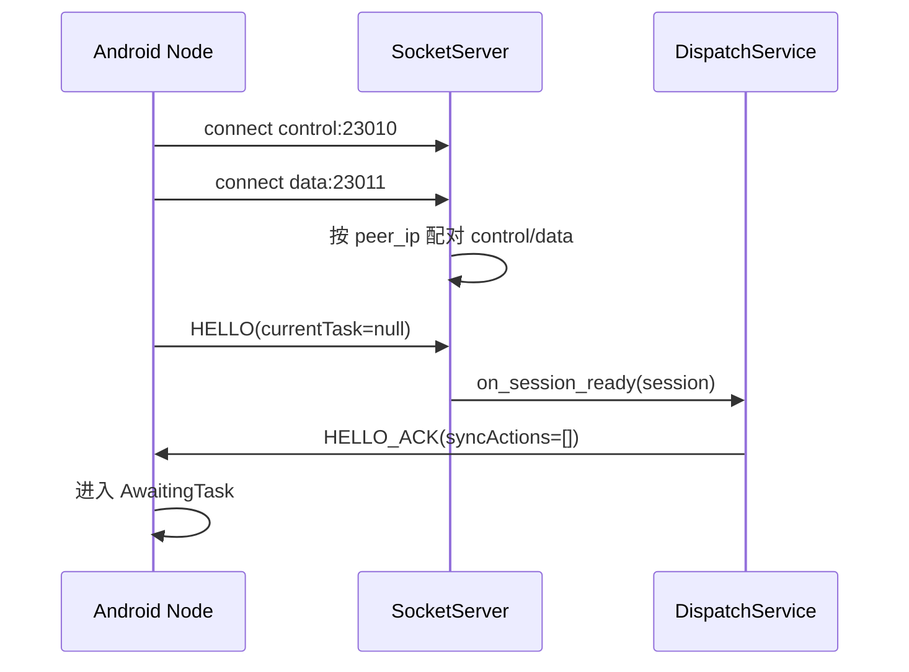
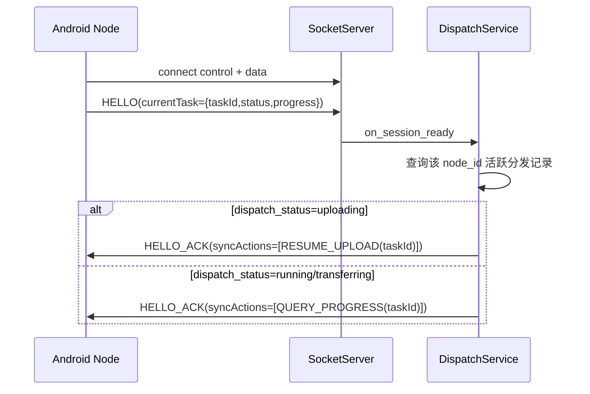
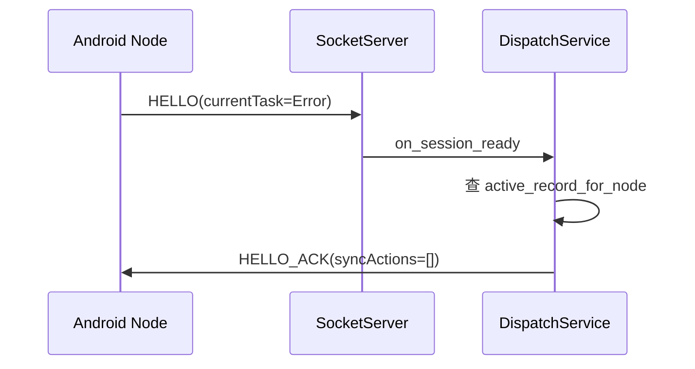
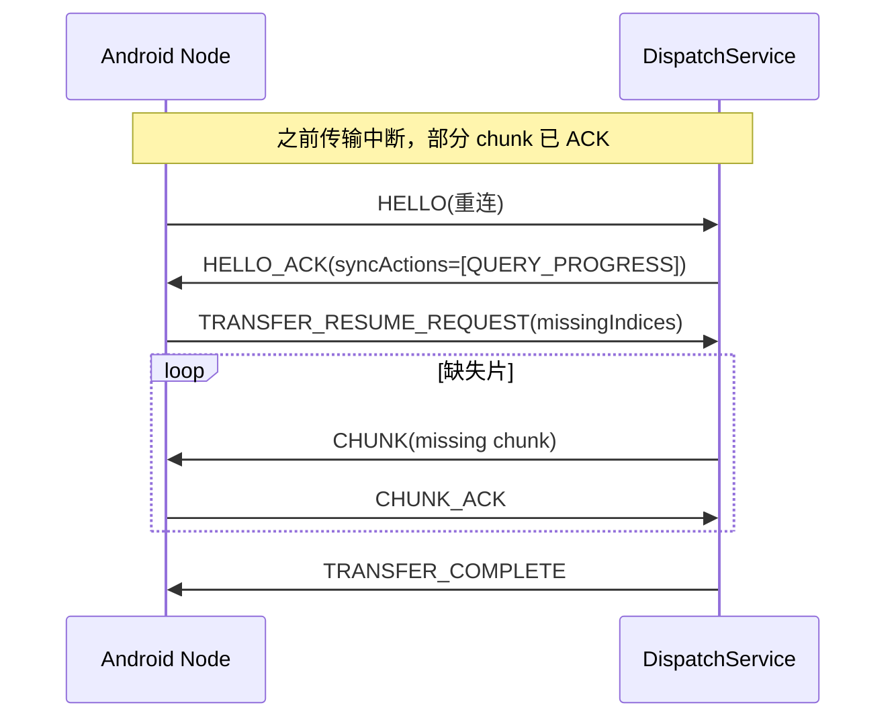
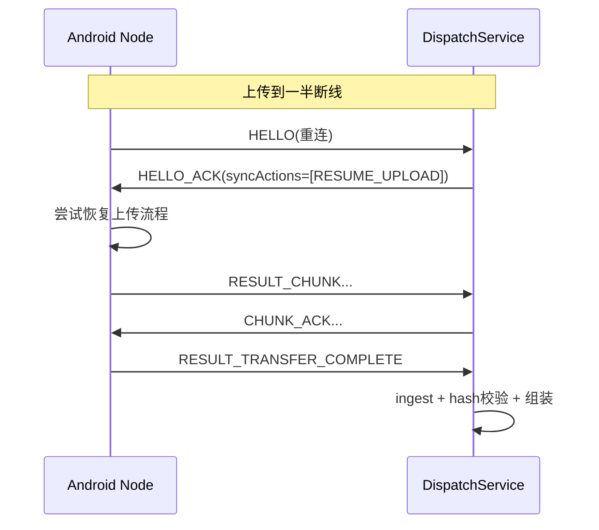
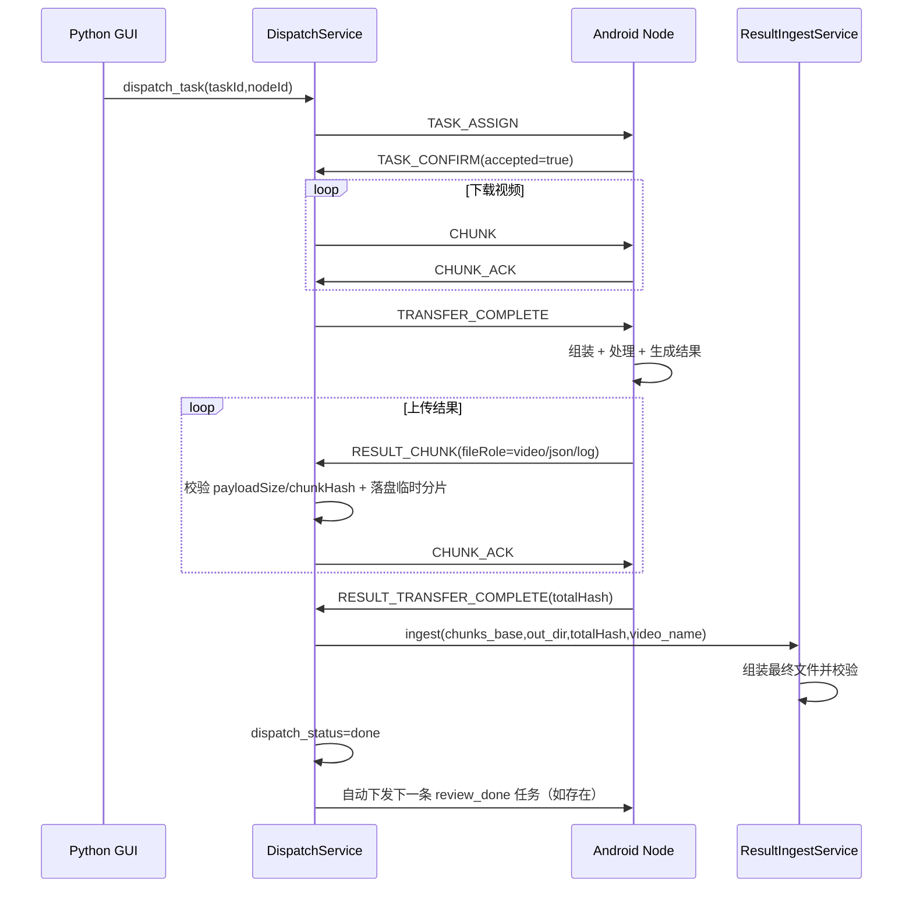

# PY 端与 Android 节点通讯时序（场景版）

> 目标：把 Python 服务端与 Android 节点之间的通讯，按可联调的“场景”讲清楚。  
> 范围：当前仓库实现（`src/` + `MediaService/`）对齐。  
> 约定：节点下线相关集中放在 SDS（本文件第 8 节）。

---

## 1. 通讯总览

- 控制通道：`23010`，newline JSON
- 数据通道：`23011`，`[4B headerLen][header JSON][payload]`
- 主要实现入口：
  - Python：`src/net/socket/socket_server.py`、`src/services/dispatch_service.py`
  - Android：`MediaService/.../SocketConnectionManager.kt`、`TaskOrchestrator.kt`、`UploadManager.kt`

### 1.1 控制消息

- Node -> PY：`HELLO`、`HEARTBEAT`、`TASK_CONFIRM`、`TASK_STATUS_REPORT`
- PY -> Node：`HELLO_ACK`、`TASK_ASSIGN`、`TASK_STATUS_QUERY`

### 1.2 数据消息

- PY -> Node：`CHUNK`、`TRANSFER_COMPLETE`
- Node -> PY：`CHUNK_ACK`、`TRANSFER_RESUME_REQUEST`、`RESULT_CHUNK`、`RESULT_TRANSFER_COMPLETE`
- PY -> Node：`CHUNK_ACK`（用于确认 `RESULT_CHUNK`）

---

## 2. 状态对齐（联调必看）

`TASK_STATUS_REPORT.status` 表达的是**任务状态**，不是连接状态。

| Android 上报 | PY 映射 dispatch_status |
|---|---|
| `AwaitingTask` | `confirmed` |
| `Receiving` | `transferring` |
| `Processing` | `running` |
| `Uploading` | `uploading` |
| `Done` | `done` |
| `Error` | `failed` |
| `Connecting`（兼容旧） | `confirmed` |

补充规则（当前实现）：
- PY 端状态更新只允许“前进”，不允许回退（例如 `running -> confirmed` 会被忽略）。

### 2.1 心跳与断线判定

- Android 每 15s 发送一次 `HEARTBEAT`（空闲/忙碌都发送）。
- Python `SocketServer` 每 5s 扫描会话，若 `last_seen_at` 超过 45s 无更新，判定 `heartbeat_timeout` 并下线。
- `last_seen_at` 会被控制/数据通道任意入站消息刷新（包括 `HEARTBEAT`）。

---

## 3. 节点上线场景

## 3.1 无任务节点上线（正常空闲）

结果：
- 节点在线，等待任务。
- 无恢复动作。

## 3.2 含未完成任务节点上线（可恢复）

未完成任务常见于 `dispatch_status in ("transferring", "running", "uploading")`。

结果：
- PY 会下发恢复动作。
- 当前实现里 `RESUME_UPLOAD` 在 Android 侧仍是待完善路径（需持续补强）。

## 3.3 含错误任务节点上线（已失败）

结果：
- 失败记录不属于活跃恢复流。
- 节点正常上线，但通常不会自动恢复失败任务。

---

## 4. PY -> Android 传输中断后上线（下载未完成）

场景：PY 正在下发 `CHUNK`，节点中断后重连。

关键点：
- PY 以 DB 未 ACK 分片 + 节点上报缺失集合做并集补发。
- 补发完成后重发 `TRANSFER_COMPLETE`。

---

## 5. Android -> PY 回传中断后上线（上传未完成）

场景：节点处理完成后上传 `RESULT_CHUNK` 中断。

关键点：
- PY 已具备 `RESUME_UPLOAD` 指令下发。
- Android 侧上传恢复要保证可闭环（当前项目中该路径需重点回归）。

---

## 6. 正常任务闭环（PY 下发任务 -> 节点回传结果）

验收通过后的落盘约定：
- 视频文件：`<原始视频名>_cut.<ext>`
- 临时目录：`.../chunks/<transferId>/` 清理

---

## 7. 你未列举但实际存在的关键场景

## 7.1 控制/数据通道先后顺序不同

- 控制先到：进入 `pending_ctrl` 等数据通道。
- 数据先到：进入 `pending_data`，控制到达后再配对。
- 两种顺序都支持，超时会关闭未完成配对连接。

## 7.2 HELLO 超时 / 配对超时

- 配对超时（30s）：连接被回收。
- HELLO 超时（30s）：session 关闭，要求重连并重新 HELLO。

## 7.3 `TASK_CONFIRM` 超时或拒绝

- 超时：记录标记 `failed`，可人工重派。
- 拒绝：记录标记 `failed`，附拒绝原因。

## 7.4 上传分片被丢弃（不 ACK）

- `payloadSize` 不一致、`chunkHash` 不一致、写盘异常：PY 不回 ACK。
- 节点会因 ACK 超时重试（上传端需有重试策略）。

## 7.5 状态上报回退

- 例如客户端错误上报 `AwaitingTask` 导致想把 `running` 回退。
- PY 会忽略回退，保持更靠后的状态。

---

## 8. 节点下线场景（SDS 收敛）

## 8.1 空闲下线

- `on_session_closed` 更新节点状态 `offline`。
- 无活跃任务时，不影响分发记录。

## 8.2 下发中下线（`transferring`）

- 记录保持活跃，等待重连。
- 重连后可走 `TRANSFER_RESUME_REQUEST` 恢复下发。

## 8.3 处理中下线（`running`）

- 记录保持 `running`。
- 重连后通过 `QUERY_PROGRESS` 拉取节点任务进度。

## 8.4 上传中下线（`uploading`）

- 记录保持 `uploading`。
- 重连后 `HELLO_ACK` 下发 `RESUME_UPLOAD`。

建议最小日志对：
- PY：`[protocol][session_closed]`、`[protocol][hello_ack_sent]`
- Android：重连 attempt/ready、`recv HELLO_ACK`

---

## 9. 联调排障最小清单

1. 是否看到 `HELLO -> HELLO_ACK` 成对。
2. 下载方向是否 `CHUNK -> CHUNK_ACK` 成对。
3. 上传方向是否 `RESULT_CHUNK -> CHUNK_ACK` 成对。
4. `RESULT_TRANSFER_COMPLETE` 后是否进入 ingest。
5. 最终是否出现 `dispatch_status=done` 与目标文件落盘。

---

## 10. 文档维护建议

协议或状态机改动后，同时更新以下 3 处，避免文档漂移：

1. `src/net/protocol/*.py`
2. `MediaService/.../net/protocol/*.kt`
3. 本文 `SDS/py_android_comm_scenarios.md`

