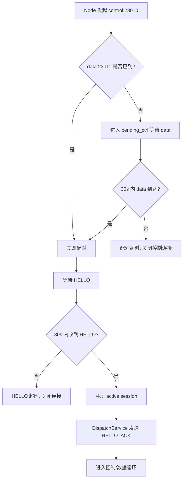
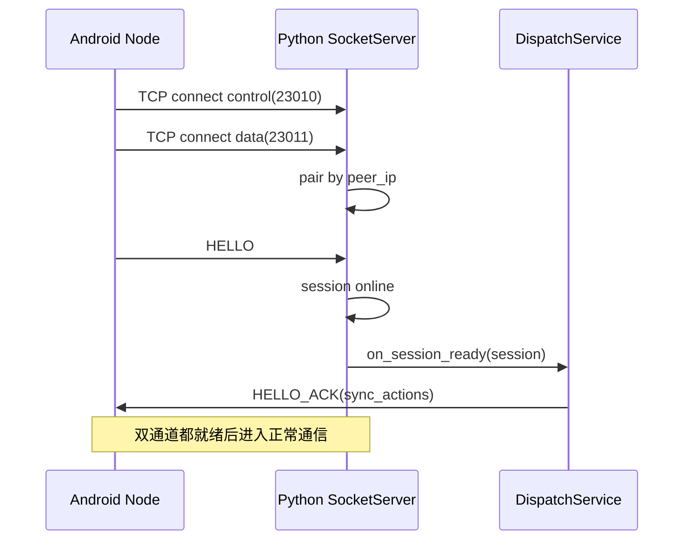
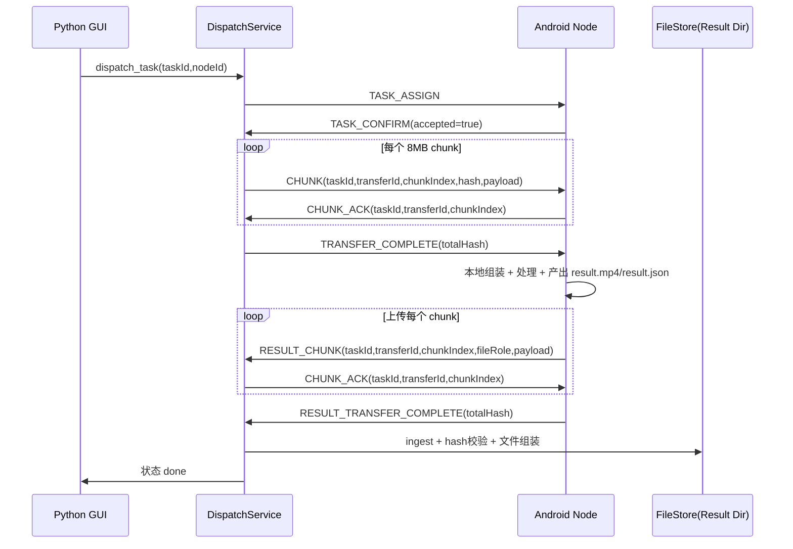
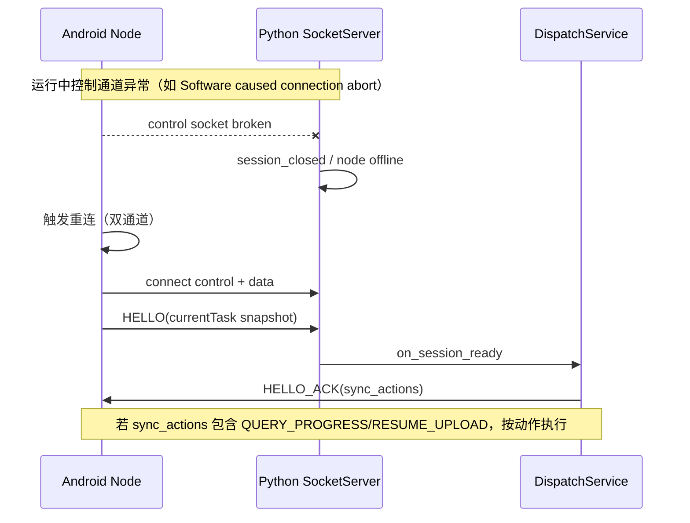

# Socket 服务端与处理节点协同设计（现网实现对齐版）

> 更新时间：2026-03-23  
> 目标：与当前 `src/net/socket/socket_server.py`、`src/services/dispatch_service.py`、`MediaService/...` 实现保持一致，降低排障理解成本。

## 1. 总览

- 服务端（Python）负责：双通道接入、任务分发、下载分片、结果回传验收、审计。
- 节点（Android）负责：双通道连接、HELLO 握手、任务执行、结果分片上传。
- 双通道固定端口：
  - 控制通道：`23010`（newline JSON）
  - 数据通道：`23011`（`[4B headerLen][header JSON][payload]`）

## 2. 当前协议消息

### 2.1 控制通道（23010）

- Node -> Server: `HELLO`, `TASK_CONFIRM`, `TASK_STATUS_REPORT`
- Server -> Node: `HELLO_ACK`, `TASK_ASSIGN`, `TASK_STATUS_QUERY`

### 2.2 数据通道（23011）

- Server -> Node（下发视频）: `CHUNK`, `TRANSFER_COMPLETE`
- Node -> Server（下载确认）: `CHUNK_ACK`, `TRANSFER_RESUME_REQUEST`
- Node -> Server（回传结果）: `RESULT_CHUNK`, `RESULT_TRANSFER_COMPLETE`
- Server -> Node（上传确认）: `CHUNK_ACK`（由 Python `MsgChunkAckOut` 发送，线协议 type 同为 `CHUNK_ACK`）

## 3. 关键实现参数（当前代码）

- 下发分片大小：`8MB`（`src/services/dispatch_service.py: DOWNLOAD_CHUNK_SIZE`）
- Android 上传分片大小：`8MB`（`MediaService/.../UploadManager.kt: CHUNK_SIZE`）
- ACK 超时：30s（下发 ACK、上传 ACK）
- 通道配对超时：30s（控制等数据；数据等控制）
- HELLO 等待超时：30s

## 3.1 实现对齐约束（联调必须遵守）

1. `HELLO_ACK` 收到后，Android 不得继续停留 `TaskState.Connecting`。
2. `TASK_STATUS_REPORT.status` 表达的是“任务状态”，不是“连接状态”。
3. `TASK_STATUS_QUERY(taskId)` 必须按 `taskId` 返回状态快照（优先本地持久化任务），不要回全局连接态。
4. Python `DispatchService` 仅识别任务态：`AwaitingTask/Receiving/Processing/Uploading/Done/Error`。
5. 若上报 `Connecting`，服务端状态机会忽略该消息（不会推进 dispatch_status）。

## 4. 节点接入与握手（细粒度）

### 4.1 流程图

### 4.2 时序图

## 5. 完整任务闭环（review_done -> done）

## 6. ACK 超时排障（重点）

### 6.1 Node 上传 `RESULT_CHUNK` 后等待 ACK 超时

常见原因按优先级：

1. **服务端未进入数据读循环**（历史 data-first 配对路径易出现，现已修复）。
2. payloadSize 或 chunkHash 校验失败，服务端按协议不 ACK，等待节点重传。
3. 服务端写盘失败（磁盘/路径权限/IO 异常），服务端不 ACK。
4. 数据通道中断，ACK 发不出去。

### 6.2 服务端新增观测点

- `[protocol][data_loop_start]`：确认数据循环已启动。
- `recv RESULT_CHUNK ...`：确认帧已进入 Python。
- `drop message reason=invalid_field ...`：payload/hash 校验失败。
- `drop message reason=write_error ...`：写盘失败。
- `send CHUNK_ACK ...`：ACK 已发出。

> 如果 Android 超时，但服务端没有 `recv RESULT_CHUNK`，先查双通道配对和读循环是否启动。  
> 如果有 `recv` 但无 `send CHUNK_ACK`，重点查 `invalid_field/write_error`。

## 7. 重连与恢复（当前实现）

### 7.1 下发方向恢复（已实现）

- 节点可发送 `TRANSFER_RESUME_REQUEST`（缺失 chunk 索引）。
- 服务端补发缺失分片并重发 `TRANSFER_COMPLETE`。

### 7.2 上传方向恢复（部分实现）

- `HELLO_ACK.sync_actions` 已支持下发 `RESUME_UPLOAD`。
- Android `TaskOrchestrator.resumeUpload(...)` 仍为 TODO（当前版本可能无法自动恢复上传）。
- 现阶段建议：上传阶段断线后，由服务端/GUI 触发重派任务或人工重试。

### 7.3 重连场景时序（控制通道异常）

## 8. 排障建议清单

### 8.0 连接卡在“连接中”但已收到 HELLO_ACK

- 判据：
  - Android 有 `recv HELLO_ACK`；
  - 仍持续上报 `TASK_STATUS_REPORT status=Connecting`。
- 定位：
  - Android `TaskOrchestrator.handleHelloAck()` 未迁出 `Connecting`；
  - Android `handleStatusQuery()` 返回了连接态而非任务态。
- 处理：
  - `HELLO_ACK` 后迁移到 `AwaitingTask`（或恢复态）；
  - `TASK_STATUS_QUERY` 返回 task-scope 快照。

1. 先看服务端是否出现 `[protocol][pair_ready]` 与 `[protocol][data_loop_start]`。
2. 再看 `TASK_ASSIGN -> TASK_CONFIRM -> CHUNK/CHUNK_ACK` 是否完整。
3. 上传超时时，对照 `recv RESULT_CHUNK` 与 `send CHUNK_ACK` 是否成对。
4. 出现 `Software caused connection abort` 时，优先检查服务端是否主动关闭（pair/hello timeout）。
5. 检查同一节点是否同时存在旧连接残留（新版本已增加 pending_data 超时清理）。

## 9. 当前限制与后续计划

- 连接建立后，Android 侧对“运行期断线自动双通道重连”仍需增强（当前更偏首次连接重试）。
- 上传恢复 `RESUME_UPLOAD` 需要补齐 Android 端实现。
- 可考虑将 `peer_ip` 配对升级为带握手 token 的配对键，降低多网卡/IPv4-IPv6 场景错配概率。

